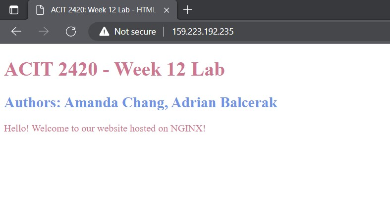

# ACIT 2420 - Week 12 Lab 

## Team Members: 
* **Amanda Chang**
* **Adrian Balcerak**

---
## Overview 

Website is hosted on NGINX Web Server. 



---

## Set Up 

1. Generate a public/private key pair 
2. Use the public key as SSH key to create a new droplet in DigitalOcean 
3. Create a regular account for the server 

---

## Step 1. NGINX Installation on Server (web-one)

1. Use `ssh -i ~/.ssh/FILE_NAME USER_NAME@DIGITALOCEAN_DROPLET_IP_ADDRESS` to log in 

2. To install NGINX, run `sudo apt update` and `sudo apt install nginx`. 


* When you see the screenshot below, press TAB to get to "Ok", then press ENTER. 


---

## Step 3 & 4 - HTML and NGINX Server Block Files 

* As a local host in your **wsl**, create an HTML and a nginx server block by using `vim FILENAME` or your favorite editor. 

**Example of HTML** 
```HTML
<!DOCTYPE html>
<html lang="en">
<head>
    <meta charset="UTF-8">
    <meta http-equiv="X-UA-Compatible" content="IE=edge">
    <meta name="viewport" content="width=device-width, initial-scale=1.0">
    <title>HTML For NGINX</title>
</head>
<body>
    <h1 style="color:palevioletred">ACIT 2420 - Week 12 Lab</h1>
    <h2 style="color:cornflowerblue">Authors: Amanda Chang, Adrian Balcerak</h2>
    <p style="color:palevioletred">Hello! Welcome to our site!</p>
</body>
</html>
```

**nginx Server Block without Domain Name**
```Shell
# It is recommended to replace <DO_DROPLET_IP_ADDRESS> with the IP address of your server from DigitalOcean, 
# as it helps to create a relationship between the locations and files. 
server {
        listen 80;
        listen [::]:80;

        root /var/www/<DO_DROPLET_IP_ADDRESS>/html;
        index index.html;

        server_name <DO_DROPLET_IP_ADDRESS>;

        location / {
                try_files $uri $uri/ =404;
        }
}
```

---

## Part 4. 

### Upload Files to Server (web-one)

* In **wsl**, use `sftp -i ~/.ssh/KEY_FILE_NAME USER_NAME@DIGITALOCEAN_DROPLET_IP_ADDRESS` and `put -r FOLDER_NAME` <br/>
to upload HTML and server block files contain inside a folder. 

**Example**


### Store Files to Appropriate Directories 

1. In **Ubuntu**, use `sudo mkdir -p /var/www/YOUR_DOMAIN/html` to create a directory in */var/www* to save your HTML file. <br/>
Move your HTML file to the directory by using `sudo mv index.html /var/www/YOUR_DOMAIN/html`. <br/>

* The permission of your web roots should allow the owner to read, write, and execute the files, <br/>
while groups and others can only read and execute. <br/> 
If you have modified your unmask value, use `sudo chmod -R 755 /var/www/YOUR_DOMAIN` to reset the permission. <br/>

**Example** 


2. Move your Nginx server block file to /etc/nginx/site-specific folder by using `sudo mv YOUR_DOMAIN /etc/nginx/sites-available`. <br/>
To enable the Nginx server block file, use `sudo ln -s /etc/nginx/sites-available/YOUR_DOMAIN /etc/nginx/sites-enabled/`

**Example** 


3. Check you configuration file by using `sudo nginx -t` 


---

## Part 5. Start / Restart NGINX Service 

1. Use the following commands to either start or restart Nginx service: 
* Start Nginx service: `sudo systemctl start nginx.service`
* Restart Nginx service: `sudo systemctl restart nginx.service`

2. Use `systemctl status nginx` to check the status of Nginx service 


### Some Basic Management Commands 

* Stop Nginx service: `sudo systemctl stop nginx.service`

* Reload Nginx service: `sudo systemctl reload nginx.service`

---

## Part 6. Before Firewall Setup 

* Type the DROPLET_IP_ADDRESS to the browser to check if your HTML is being served by the NGINX web server 


---

## Part 7. Setup Firewall Using UFW 

1. Setup firewall to allow incoming HTTP and SSH connections
* `sudo ufw allow 'Nginx HTTP'` allows HTTP 
* `sudo ufw allow OpenSSH` allows SSH connections 

2. Use `sudo ufw enable` to enable the firewall 

3. `sudo ufw status` displays the status of Nginx service and the allowed traffic status, which can be used to verify changes 

**Example**


### General Commands: 

* `sudo ufw app list` display a list of available applications 

--- 

## Part 8. After Firewall Setup 

1. Log out of the regular user account of the web-one server 

2. Re-login to the web-one server as a regular user via `ssh -i ~/.ssh/FILE_NAME USER_NAME@DIGITALOCEAN_DROPLET_IP_ADDRESS` to verify **allow OpenSSH** firewall rule. 

3. Restart Nginx service via `to verify **allow Nginx HTTP** firewall rule. 